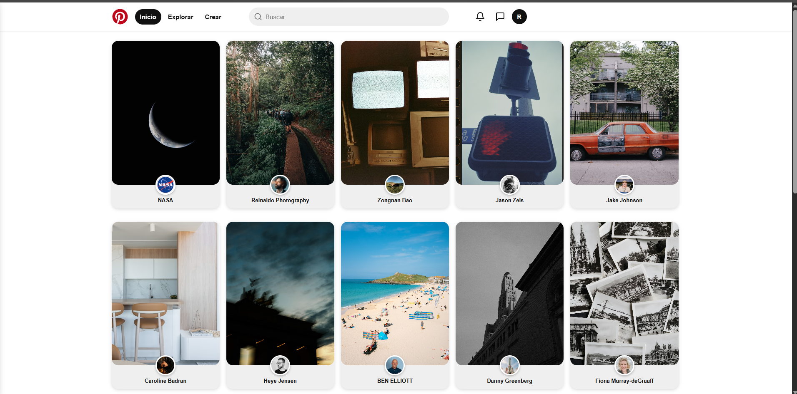
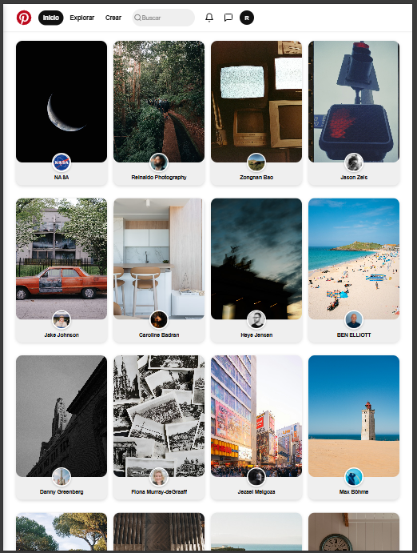
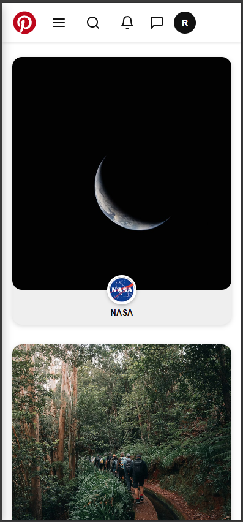

# 📌 Pinterest Clone

> Proyecto de aprendizaje desarrollado como práctica del programa **[The Powerd](https://thepower.education/)**.

Réplica funcional de Pinterest construida desde cero con **Vite** y **Vanilla JavaScript puro**, sin frameworks ni librerías de UI. Consume la API oficial de **Unsplash** para mostrar imágenes reales en un layout masonry responsive.

🌐 **[Ver demo en vivo](https://pinteres-async.netlify.app/)** · 📂 **[Repositorio](https://github.com/rubenferbu/pinterest-async)**

---

## 📸 Capturas de pantalla

<div align="center">
  
  
  
</div>

---

## 🛠️ Stack tecnológico

| Tecnología | Versión | Uso |
|---|---|---|
| **Vite** | 8.x | Bundler y servidor de desarrollo |
| **Vanilla JavaScript** | ES2022+ | Lógica de la aplicación |
| **CSS3** | — | Estilos, variables y layout |
| **Unsplash API** | v1 | Fuente de imágenes |
| **Netlify** | — | Despliegue continuo en producción |

---

## 🏗️ Arquitectura del proyecto

El proyecto implementa una **arquitectura basada en componentes** en Vanilla JS, inspirada en los principios de React pero sin ninguna dependencia externa.

```
pinterest-async/
├── src/
│   ├── assets/
│   │   ├── docs/           # Capturas de pantalla
│   │   └── icons/          # SVG icons
│   ├── components/         # Componentes de UI (cada uno con su JS y CSS)
│   │   ├── footer/
│   │   ├── gallery/
│   │   ├── header/
│   │   ├── imageCard/
│   │   ├── loader/
│   │   └── searchBar/
│   ├── hooks/
│   │   └── useUnsplash.js  # Gestión de estado (patrón Observer)
│   ├── services/
│   │   └── unsplashApi.js  # Capa de acceso a la API
│   ├── styles/
│   │   └── global.css      # Variables CSS y estilos globales
│   ├── utils/
│   │   └── loadIcon.js     # Carga de SVGs inline con Vite ?raw
│   └── main.js             # Punto de entrada y renderizado
├── .env.example            # Plantilla de variables de entorno
├── netlify.toml            # Configuración de despliegue
└── vite.config.js          # Configuración de Vite
```

---

## 🧠 Conceptos técnicos aplicados

### Patrón Observer — Gestión de estado reactivo

En vez de usar `useState` de React, se implementó manualmente un sistema de suscriptores que notifica a la UI cada vez que el estado cambia:

```js
// Cualquier módulo puede suscribirse a los cambios de estado
subscribe(render);

// Cuando el estado cambia, se notifica a todos los suscriptores
function notify() {
  listeners.forEach((callback) => callback(state));
}
```

### Arquitectura de componentes en Vanilla JS

Cada componente es una función pura que recibe datos y devuelve un elemento del DOM, sin efectos secundarios:

```js
// Principio: recibe datos → devuelve HTML
export function createImageCard(photo) {
  const article = document.createElement('article');
  // ... construcción del elemento
  return article;
}
```

### Layout Masonry con CSS columns

Se consigue el efecto Pinterest sin JavaScript, usando exclusivamente CSS:

```css
.gallery {
  column-count: 5;
  column-gap: 16px;
}

.image-card {
  break-inside: avoid;
  display: inline-block;
  width: 100%;
}
```

### Async/Await con manejo de errores

Todas las peticiones a la API están controladas con `try/catch` y gestionan los tres estados posibles de la UI:

```js
export async function loadInitialImages() {
  state.isLoading = true;
  notify();
  try {
    const data = await getRandomImages(20);
    state.images = data;
  } catch (error) {
    state.error = 'No se pudieron cargar las imágenes.';
  } finally {
    state.isLoading = false;
    notify();
  }
}
```

---

## ✨ Funcionalidades

- 🖼️ Carga inicial de imágenes aleatorias desde Unsplash
- 🔍 Búsqueda de imágenes por término con limpieza automática del input
- 🔄 Reset a la galería inicial al hacer clic en el logo o "Inicio"
- ⏳ Loader durante peticiones a la API
- ❌ Mensaje de error si la petición falla o no hay resultados
- 🎨 Layout masonry responsive (1 / 2 / 4 / 5 columnas según breakpoint)
- 🖱️ Efecto hover con overlay oscuro y botón "Visitar"
- 📱 Header responsive con menú lateral en móvil y buscador toggle
- ♿ HTML semántico con roles ARIA y navegación por teclado
- 🔎 SEO básico con meta tags

---

## 📦 Recursos externos utilizados

| Recurso | Tipo | Uso en el proyecto |
|---|---|---|
| [Unsplash API](https://unsplash.com/developers) | API REST | Fuente de todas las imágenes mostradas en la galería |
| [Unsplash](https://unsplash.com) | Plataforma | Crédito a fotógrafos (nombre, avatar, enlace al perfil) |
| [SVGRepo](https://www.svgrepo.com) | Librería de iconos | Iconos SVG: bell, message, search, menu, close, github y logo Pinterest |
| Claude AI (Anthropic) | Inteligencia Artificial | Generación y adaptación de algunos iconos SVG |

> Todos los iconos SVG descargados de SVGRepo se usan bajo su licencia de uso libre.  
> Las imágenes mostradas en la aplicación pertenecen a sus respectivos autores en Unsplash y se muestran respetando los términos de uso de su API.

---

## 🚀 Instalación y uso local

### Prerequisitos

- Node.js `v20+`
- npm `v9+`
- API Key gratuita de [Unsplash Developers](https://unsplash.com/developers)

### Pasos

```bash
# 1. Clona el repositorio
git clone https://github.com/rubenferbu/pinterest-async.git
cd pinterest-async

# 2. Instala las dependencias
npm install

# 3. Configura las variables de entorno
cp .env.example .env
# Edita .env y añade tu Access Key de Unsplash

# 4. Arranca el servidor de desarrollo
npm run dev
```

Abre [http://localhost:5173](http://localhost:5173) en tu navegador.

### Scripts disponibles

| Comando | Descripción |
|---|---|
| `npm run dev` | Servidor de desarrollo con hot reload |
| `npm run build` | Build de producción en `/dist` |
| `npm run preview` | Preview del build de producción |

---

## 🌐 Despliegue

Desplegado en **Netlify** con integración continua desde GitHub. Cada `git push` a `main` genera un nuevo deploy automático.

La API Key se gestiona como variable de entorno en el panel de Netlify, nunca expuesta en el repositorio.

---

## 👤 Autor

**Rubén Fernández**

- GitHub: [@rubenferbu](https://github.com/rubenferbu)
- Proyecto: [pinterest-async](https://github.com/rubenferbu/pinterest-async)

---

## 📄 Licencia

Proyecto de uso educativo desarrollado como práctica del programa **[The Powerd](https://thepower.education/)**.

Las imágenes son proporcionadas por [Unsplash](https://unsplash.com) bajo su propia licencia de uso.